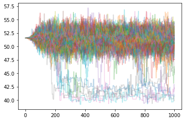
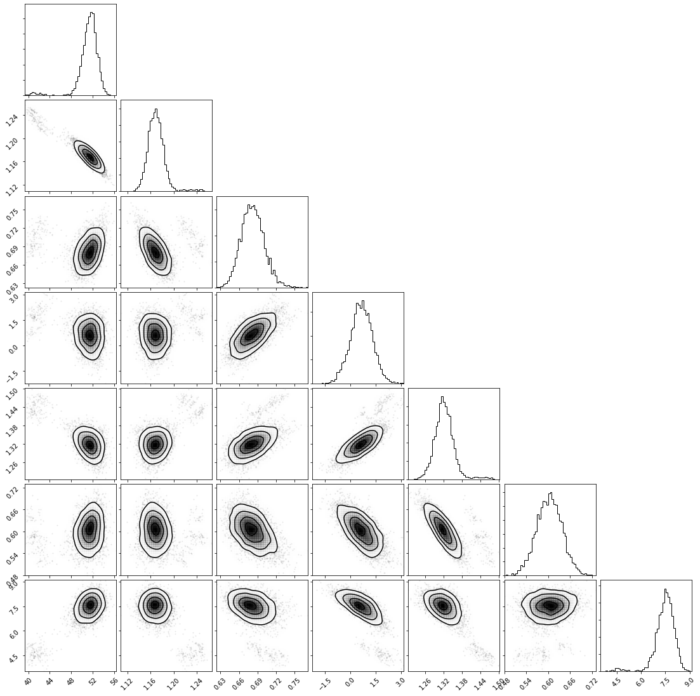
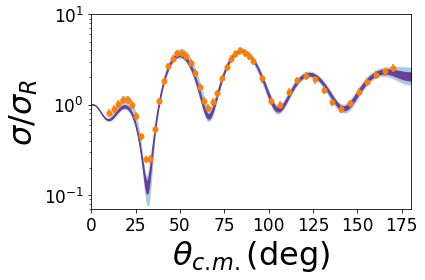
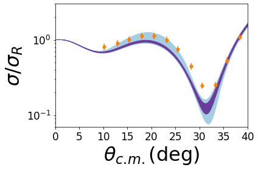

Simple Bayesian Example
=======================

Bayesian fit with wide, normal priors.

.. code:: ipython3

    %matplotlib inline
    import pfunk
    import matplotlib.pyplot as plt
    import corner
    import numpy as np
    import os

.. code:: ipython3

    # get all of the data and Fresco input
    fresco_path = '48Ca_elastic_new.in'
    fresco_names = ['p1', 'p2', 'p3', 'p4', ('p5', 'p5'), ('p6', 'p6'), 'p4']
    fresco_positions = [54, 55, 56, 57, (58, 66), (59, 67), 65]
    elastic_data_path = '48Ca_p_p.dat'

Next we create the model instance, and setup wide priors (:math:`100 \%`
of global value).

.. code:: ipython3

    model = pfunk.model.Model(fresco_path, fresco_names, fresco_positions) # create model
    model.create_pot_prior(model.fresco.x0, model.fresco.x0) # 100% priors from global values
    model.create_prior() # Finish setting up the prior functions

Setup likelihood function.

.. code:: ipython3

    model.create_elastic_likelihood('fort.201', elastic_data_path)
    model.create_likelihood()

Do the initial minimization of the posterior function.

.. code:: ipython3

    fit = pfunk.model_fit.MAPFit(model, percent_range=5.0)
    fit.run_anneal(max_iter=1000)

.. parsed-literal::

    The initial logprob value is  355.3108613586819
     At minimum 13.7145 accepted 1 iteration 7  Total Accepted : 3

.. code:: ipython3

    model.x0 = fit.results.x[:] # set model initial values to fit results

Setup the sampler.

.. code:: ipython3

    sampler = pfunk.sampler.Sampler(model)
    sampler.nwalker = 200
    sampler.nstep = 1000
    sampler.ball_init() # scatter walks around initial value

.. code:: ipython3

    sampler.check_p0() # make sure values are finite.

.. parsed-literal::

    array([-23.60770497, -22.85155926, -22.43636047, -25.91722338,
           -31.93265203, -26.34836429, -25.49977787, -46.56710316,
           -21.24151792, -18.90726327, -17.24634475, -25.56137742,
           -16.07352884, -24.62785956, -16.7968962 , -19.43965299,
           -16.35958254, -15.00585935, -15.41770233, -25.26345162,
           -17.79927082, -17.68044505, -35.91814331, -48.48088752,
           -38.20688306, -15.61885816, -33.86649941, -30.59784684,
           -21.57531638, -15.76617686, -56.63500068, -24.75493294,
           -19.07226323, -30.62455288, -23.19515849, -16.1586296 ,
           -16.79215691, -32.1125801 , -21.76893909, -19.80997399,
           -14.76943162, -34.18162896, -66.47222875, -42.28078891,
           -14.99274371, -17.54099901, -19.90022662, -17.27039246,
           -19.57273003, -18.96138039, -19.81473561, -22.76578769,
           -16.9903213 , -26.81321911, -32.66286909, -21.17119558,
           -24.54959931, -36.91391756, -24.07911958, -26.96858555,
           -23.2663992 , -28.6264821 , -35.447923  , -17.4338462 ,
           -25.66430172, -32.32115534, -23.17718862, -32.32911295,
           -19.06247162, -22.2815642 , -23.64782008, -35.40658607,
           -28.31149949, -36.2871604 , -24.75704534, -53.32005015,
           -19.45625833, -19.16966518, -22.62726994, -20.78572045,
           -25.09768854, -26.70793881, -26.3895211 , -21.21678249,
           -25.7485669 , -27.45337627, -30.38460943, -17.19927161,
           -16.22401033, -17.36753758, -27.82609721, -15.84579748,
           -30.85558271, -20.70433684, -37.20999952, -17.62603071,
           -21.82425416, -36.85525324, -33.81481713, -17.72042942,
           -15.45336713, -24.71845244, -47.66774305, -31.66932865,
           -31.65393189, -21.27067242, -27.62573842, -14.88522689,
           -14.41569593, -19.24559341, -26.5939771 , -23.14987965,
           -18.44294254, -14.79059409, -26.09444184, -19.65113889,
           -14.56808145, -25.47142876, -19.92994854, -15.48977773,
           -32.21017706, -20.36795756, -16.68698513, -29.01825729,
           -14.85778934, -29.85236718, -36.68692792, -29.27527021,
           -19.07919564, -21.75139576, -17.04931903, -25.43112892,
           -17.04898482, -16.57852668, -15.07531262, -19.94570111,
           -16.84796981, -16.49878055, -17.98555468, -16.22700297,
           -37.49205231, -17.38949913, -20.50196278, -22.45571943,
           -36.81949721, -17.94100256, -15.92495926, -29.99180003,
           -22.65616319, -19.06620463, -30.02122966, -23.71465776,
           -27.97129406, -30.12378713, -16.27232031, -41.39185486,
           -14.11884304, -23.72964784, -32.84282493, -14.06766478,
           -19.1509164 , -24.71233584, -22.48527921, -22.20476354,
           -32.9355606 , -25.69843015, -28.58863393, -50.9807763 ,
           -38.26794005, -32.14575366, -48.65781495, -23.40698307,
           -18.06883926, -22.57450248, -33.86797581, -22.7032054 ,
           -18.98256393, -43.50976644, -17.26609095, -19.61123275,
           -39.16212033, -19.54140412, -28.29095413, -21.39412008,
           -16.06709067, -25.63285212, -27.25481368, -16.11991935,
           -17.25876097, -19.11337191, -25.82964048, -20.79970228,
           -21.21942444, -29.83941811, -14.78839594, -46.63875452,
           -17.79754116, -15.94854461, -17.28405772, -24.67641109])

.. code:: ipython3

    sampler.run_ensemble() # now run emcee

.. parsed-literal::

    100%|██████████| 1000/1000 [55:18<00:00,  3.32s/it]

.. code:: ipython3

    p = plt.plot(sampler.sampler.get_chain()[:,:,0], alpha=0.3)

.. code:: ipython3

    s = sampler.sampler.get_chain(flat=True, discard=500, thin=20) # get samples remove burn in and thin.

.. code:: ipython3

    labels = ['$V$', '$r_0$', '$a_0$', '$W$', '$r_i$', '$a_i$', '$W_S$']
    p = corner.corner(s, bins=50, smooth=1.5, labels=labels, 
                      show_titles=True, title_kwargs={'fontsize':17.0}, 
                      label_kwargs={'fontsize':17.0})

Lets plot the cross sections credibility intervals. First we have to
rerun FRESCO on the samples

.. code:: ipython3

    all_cs = []
    for ele in s:
        model.run_fresco(ele)
        cs_temp = pfunk.fresco_classes.read_cross('fort.201')
        all_cs.append(cs_temp)

Next these cross sections can be plotted using the :func:`pfunk.utilities.plot_ci` function.  

.. code:: ipython3

    d = model.likelihood[0].data
    pfunk.utilities.plot_ci(all_cs, data=d)
    plt.ylim(0.07, 10.0)
    plt.ylabel('$\sigma / \sigma_R$')
    plt.xticks(fontsize=17)
    plt.yticks(fontsize=17)
    plt.tight_layout()

Let’s zoom in to get a better view.

.. code:: ipython3

    pfunk.utilities.plot_ci(all_cs, data=d)
    plt.xlim(0.0, 40.0)
    plt.ylim(0.07, 3.0)
    plt.ylabel('$\sigma / \sigma_R$')
    plt.xticks(fontsize=17)
    plt.yticks(fontsize=17)
    plt.tight_layout()

It is obvious that there are several issues with this fit. These will be
examined in the next few sections.

